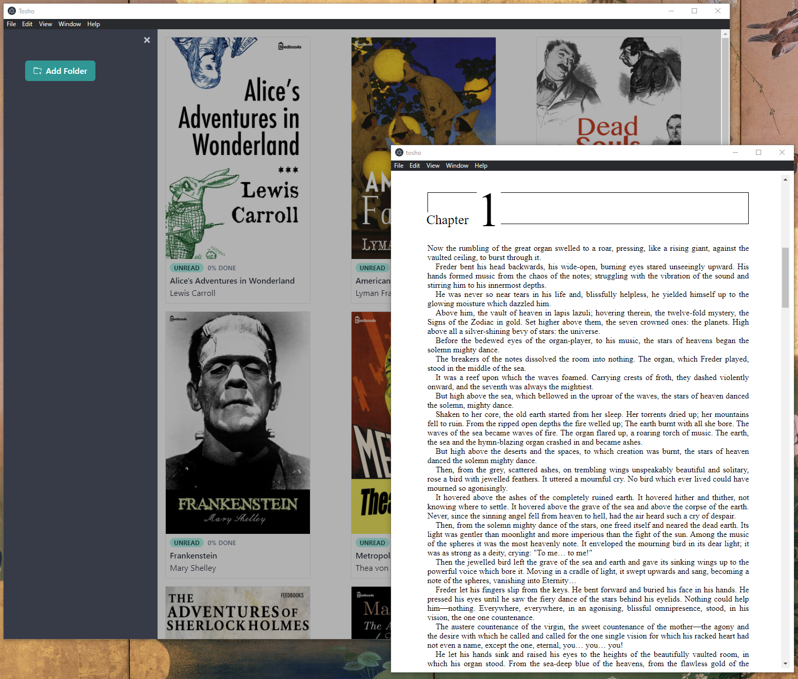

# Tosho :book:

Modern UI, cross-platform ebook manager.

Tosho aims to solve the void of cross-platform ebook readers that can handle all popular book file types (epub, pdf, markdown, comic archive formats) while also providing many features to make it feel like a true personal ebook library.

**LEGEND**

- :heavy_check_mark: : DONE
- :negative_squared_cross_mark: : MOSTLY DONE
- :hourglass_flowing_sand: : IN PROGRESS

### Goals For The Week Of 10/3 - 10/9

[ :heavy_check_mark: ] Dynamically render, cover art, book links from a system directory into the main view.  
[ :heavy_check_mark: ] Migrate to typescript.  
[ :heavy_check_mark: ] Add EPUB support.  
[ :heavy_check_mark: ] Refactor to disable nodeIntegration and enable contextIsolation.  
[ :heavy_check_mark: ] Abstract out current functionality into interfaces.  
[ :heavy_check_mark: ] Add a burger main menu.  
[ :heavy_check_mark: ] Add "Import Folder" functionality.  
[ :hourglass_flowing_sand: ] Add a persistent file library.  

### Goals For The Week Of 10/10 - 10/16

[ :hourglass_flowing_sand: ] Add "Drag and Drop Files" functionality.  
[ :hourglass_flowing_sand: ] Integrate GraphQL for future functionality plans.  
[ :hourglass_flowing_sand: ] Add PDF support.  
[ :hourglass_flowing_sand: ] Add "Remove Book(s)" functionality  
